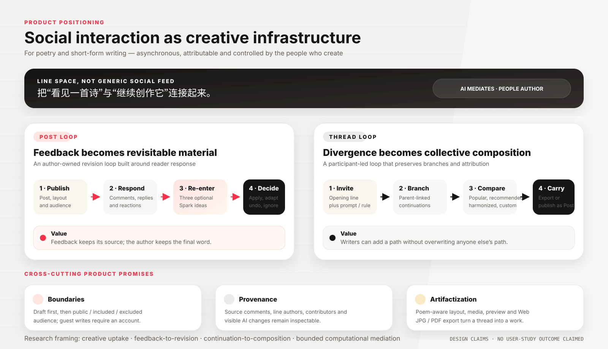
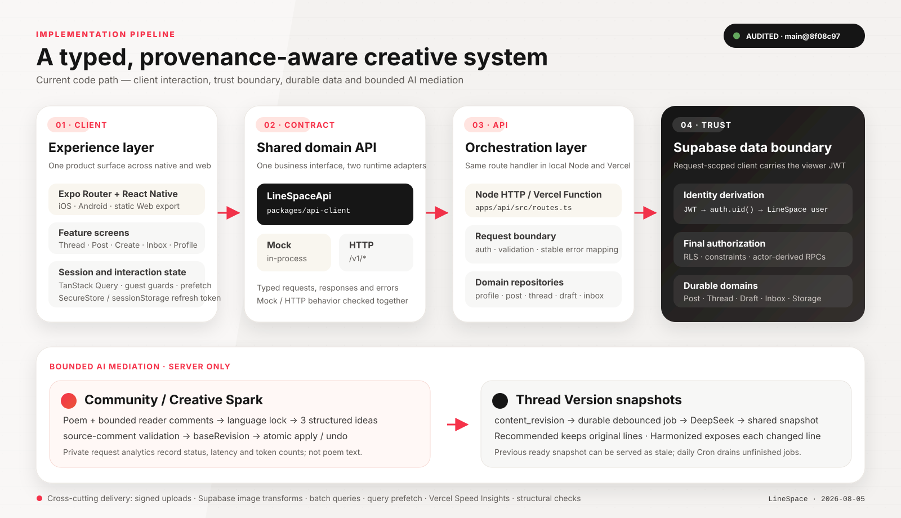

# LineSpace

> 把社交互动变成可回访、可归因、由创作者控制的创作基础设施。

LineSpace 是一个面向在线诗歌与短文本社群的移动优先创作平台，覆盖 iOS、Android 与 Web。它不是通用内容社区，也不是让 AI 代替作者写诗的工具；它把社交媒体中熟悉的 Post、评论、Thread 与回复重新组织为两条创作回路：

- **Post：反馈 → 修订。** 读者评论可以被作者重新带回编辑过程，成为有来源的修订或续写线索。
- **Thread：续写 → 共作。** 参与者沿任意已有诗句继续写作，保留分支、逐行作者与多种可阅读版本。

当前仓库是 TypeScript Monorepo：Expo/React Native 客户端通过共享 `LineSpaceApi` 契约访问 Mock 或 HTTP 实现；Node/Vercel API 使用带当前 JWT 的 request-scoped Supabase Client，由 PostgreSQL RLS、约束与 actor-derived RPC 完成最终授权。

> **实现审阅基线**：本文档按 `main@8f08c97`（2026-08-05）逐项核对移动端、API 契约、路由、Repository、30 个正式 Supabase Migration、Vercel 配置及检查脚本。CHI 2027 论文仍是准备中的研究稿；本文只陈述代码已经实现的能力，不把尚未完成的研究结果写成产品结论。



## 产品定位与价值

LineSpace 解决的核心问题不是“如何生成更多文字”，而是 **creative uptake**：一次评论、一种理解或一条续写，如何在不抹去来源、不夺走作者判断的前提下，真正进入后续创作。

| 对象 | 当前产品价值 | 已实现机制 |
| --- | --- | --- |
| 独立作者 | 不让有价值的反馈沉入评论流 | Post 评论、Community Spark、来源评论、版本指纹、应用/撤销 |
| 协作写作者 | 异步贡献新方向，同时不覆盖他人的方向 | 父子 Continuation、分支树、稳定行号、逐行作者、版本预览 |
| 阅读者与社群 | 让解释、鼓励和续写留下可识别的贡献痕迹 | 评论/回复、Credits、贡献者、Inbox 活动、关注关系 |
| 作品本身 | 从编辑中的文本变成可保存、可发布、可传播的作品 | 模板、字体、背景、媒体、预览、Post、Web JPG/PDF 导出 |
| 研究与设计 | 将社交媒体 affordance 落到创作过程，而非只服务互动指标 | Post 回路、Thread 回路、边界控制、来源追踪、受限 AI 中介 |

### 1. Post：反馈驱动的作者修订

1. 作者发布 Post；读者通过评论、回复、喜欢、收藏与分享参与。
2. 作者可从 Post 详情或编辑中的作品主动打开 Creative / Community Spark。
3. 服务端读取当前诗作与受限数量的非作者评论；评论被当作不可信引用材料，不能覆盖系统规则。
4. 模型固定按诗作的主要语言输出，返回恰好三条 `revise` 或 `continue` 建议。
5. 只有真正落实某条评论独特观察的建议才能携带该评论 ID；服务端再次验证 ID 必须来自本次已加载评论。
6. 每批建议绑定 `baseRevision`。作者改过原文后，旧建议不能覆盖新版本。
7. HTTP 模式通过数据库 RPC 原子应用、撤销或重新应用建议，并保存来源评论、修改前后版本与贡献署名。

AI 在这里负责把分散反馈转译为可比较的可能性；是否采用、如何继续修改，仍由作者决定。

### 2. Thread：保留分支的异步共作

1. 发起者提供标题、首行，以及可选的主题或规则。
2. 参与者选择任意首行或 Continuation 作为父节点继续写作，形成树而非共享文档中的单一路径。
3. 客户端从根到叶构建候选诗作，保留逐行作者、稳定行号与参与者集合。
4. 版本页当前提供 `Most Popular`、`Recommended`、`AI Harmonized`，并在存在用户选择时加入 `Custom`。
5. `Recommended` 只选择一条已有的人类创作路径，不改写任何原句。
6. `AI Harmonized` 是独立版本：只能在 Recommended 路径内做受限的短语/从句级调整；被修改的行保留原文并展示 change note。
7. Thread 发起者或实际参与者可以把选中版本发布为 Post；Web 端还可导出 JPG/PDF。

这一区分很重要：**推荐是比较已有路径，Harmonized 才是可见、可追踪的编辑版本。**

## 最新实现快照

近期主分支已经落地以下变化：

- **关注链路贯通**：Poem 详情与他人 Profile 从后端读取真实关系状态，支持关注/取消关注；成功后同步 Profile 计数、Poem 缓存与 Feed。
- **Community Spark vNext**：增加中英文输出锁、评论相关性反事实检查、三条差异化建议、来源约束与未保存 working copy 支持。
- **Spark 原子历史**：数据库通过版本指纹、行级锁与幂等记录支持安全 apply、undo 和 reapply；过期建议返回冲突而不是覆盖新文本。
- **AI 使用分析**：服务端私有表记录 Spark 请求的功能入口、状态、模型、耗时、token 数与错误码；`anon` 和 `authenticated` 无表权限。
- **Thread AI v3**：内容修订触发持久任务；共享快照同时保存 Recommended 与 AI Harmonized，避免每位阅读者或每次翻页重复调用模型。
- **交付与性能**：启用 Vercel Speed Insights；Feed 使用远程媒体 URL、Supabase 缩略图转换、批量查询、Query 缓存与点击预取，并有结构检查防止回退到已知 N+1 路径。

## 技术 Pipeline



### 主业务请求

```text
Expo Feature Screen
  -> LineSpaceApi
  -> MockLineSpaceApi
     or HttpLineSpaceApi + Bearer access token
  -> apps/api/src/routes.ts
  -> Auth Service / domain Repository
  -> request-scoped Supabase Client
  -> auth.uid() -> current_linespace_user_id()
  -> PostgreSQL RLS / constraints / actor-derived RPC
  -> Post / Thread / Draft / Inbox / Storage
```

### Community / Creative Spark

```text
Author action
  -> current poem or unsaved working copy
  + server-loaded bounded reader comments
  -> language lock + prompt-injection boundary
  -> DeepSeek Chat Completions JSON schema
  -> exactly 3 normalized suggestions
  -> source-comment ID validation
  -> baseRevision check
  -> atomic apply / undo / reapply RPC
  -> private usage analytics completion
```

### Thread Version AI

```text
Thread / Continuation content change
  -> poetry_threads.content_revision + database trigger
  -> coalesced durable job, default 12-second debounce
  -> root-to-leaf candidate paths, each node sent once
  -> DeepSeek selection + bounded harmonization
  -> content-addressed shared snapshot
  -> Recommended + AI Harmonized
  -> previous ready snapshot served as stale while refreshing
  -> Vercel waitUntil + daily Cron recovery
```

Likes、收藏、分享、页面刷新和左右翻页不会增加 `content_revision`，因此不会为相同内容重复生成 Thread AI 快照。

## 系统架构

### Monorepo 边界

```text
LineSpace-mobile/
├─ apps/
│  ├─ mobile/                 # Expo Router、Feature、Auth、Query、导出与媒体上传
│  └─ api/                    # Node/Vercel 路由、AI、Auth、Repository、检查脚本
├─ packages/
│  ├─ api-client/             # 类型、LineSpaceApi、Mock、HTTP、Auth Client
│  ├─ ui/                     # 无业务网络依赖的 React Native 组件与图标
│  └─ tokens/                 # 颜色、字体、间距、圆角等设计变量
├─ api/                       # Vercel Function 稳定入口
├─ supabase/migrations/       # 唯一可部署的有序数据库迁移链
├─ docs/                      # 架构、环境、部署、AI 后台任务与配图
├─ vercel.json
└─ package.json
```

允许的主要依赖方向：

```text
apps/mobile ──> packages/api-client
             └─> packages/ui ──> packages/tokens

apps/api    ──> packages/api-client
```

移动端 Feature 不直接访问 Supabase，也不持有 Service Role 或 AI Key；`packages/ui` 和 `packages/tokens` 不依赖业务网络层。

### 身份与信任边界

- HTTP 请求中的当前用户来自认证 Session/JWT，而不是 `userId`、`viewerId` 或 `senderId` 参数。
- 普通 Repository 为每个请求创建携带当前 Bearer JWT 的 Supabase Client。
- 数据库通过 `auth.uid()` 映射 `public.users.id`，并用 RLS、约束和事务 RPC 再次授权。
- Service Role 仅用于用户名注册/认证映射、Thread AI 后台 worker 与私有 AI 分析等明确服务端动作。
- Native Refresh Token 存入 Expo SecureStore；Web 存入 `sessionStorage`；Access Token 只驻留内存。

### 数据模式

| 模式 | 启用方式 | 用途与边界 |
| --- | --- | --- |
| Mock | `EXPO_PUBLIC_USE_MOCKS=true` | UI/Feature 开发；数据仅存在于进程内，固定开发身份可由 `EXPO_PUBLIC_CURRENT_USER_ID` 指定 |
| HTTP | `EXPO_PUBLIC_USE_MOCKS=false` | 真实 Auth、API、PostgreSQL/RLS 与 Storage；生产身份只来自 Session/JWT |

Web 未提供 API 地址时默认使用同源 `/api`；Native HTTP 构建必须提供绝对 `EXPO_PUBLIC_API_BASE_URL`。Mock 只有显式设为 `true` 才启用，不会静默伪装成真实登录。

## 已实现能力

| 产品域 | 当前代码能力 |
| --- | --- |
| Guest | 无账号浏览公开 Post、Thread、搜索、标签与公开 Profile；写作、互动、关注、分享和 Inbox 操作触发登录引导 |
| Auth | 用户名/密码注册与登录、刷新、退出、`/me`、已登录改密；产品不收集注册邮箱，不提供邮件找回 |
| Post | 标题、正文、分段空行、标签、媒体、布局、草稿、发布、编辑、删除、评论/回复、喜欢、收藏、分享 |
| Thread | 首行与主题/规则分离、父子 Continuation、完整分支树、稳定行号、互动、分享、删除、版本发布为 Post |
| Version | Most Popular、共享 Recommended、共享 AI Harmonized、Custom；逐行归因、AI 改动说明、后台快照状态 |
| Compose | 普通诗作/Relay 草稿、预览、模板/字体/背景/贴纸、媒体、可见范围、协作者邀请、保存与发布 |
| Discovery | Post Feed 的 latest/popular/following，Thread Feed 的 top/latest/following，跨 Post/Thread/User 搜索与标签页 |
| Profile | 资料编辑、头像、简介、可见性、关注/取消关注、Followers/Following、Posts/Threads/Saves/Comments、草稿、经验与徽章 |
| Inbox | 活动摘要与已读、私聊、群聊、邀请、群成员管理、Post/Thread/Continuation 分享卡片 |
| AI | Creative Spark、Community Spark、Thread Recommended 与 AI Harmonized；全部通过服务端密钥调用 |
| Artifact | Post 与 Thread Version 的布局预览；Web 端 JPG/PDF 下载；Native 当前不提供卡片下载 |

## 项目优势与差异化设计

以下是代码已经执行的设计约束，不是未经验证的市场或论文效果结论。

1. **来源不是 UI 装饰，而是数据约束。** Spark 只能引用本次实际加载的评论；Thread 每行保留作者；AI 改动保留原文和 change note。
2. **作者控制由并发协议保证。** Spark 建议携带 SHA-256 `baseRevision`；数据库原子 apply/undo 会拒绝过期版本，避免最后写入者静默覆盖。
3. **人类原文与 AI 编辑明确分层。** Recommended 版本不可改写；Harmonized 独立展示并标出每一处已接受的模型改动。
4. **AI 结果按内容共享，而不是按页面请求生成。** Thread 快照键包含 revision、prompt version 和 model；持久 job、旧快照与 Cron 处理失败恢复和调用成本。
5. **API 契约贯穿 Mock 到真实后端。** 移动端只依赖 `LineSpaceApi`；Mock、HTTP、路由和 Repository 通过类型与 smoke check 保持对齐。
6. **授权下沉到数据库。** 路由先校验，RLS/RPC 再以 JWT 推导的 actor 做最终判断，前端携带的资源 ID 不能单独构成权限。
7. **移动媒体与 Feed 性能有明确工程路径。** 客户端压缩图片、请求用户作用域 signed upload URL、数据库只保存远程 URL；Feed 使用派生缩略图、批量关系查询与内容预取。

## 技术栈

| 层 | 当前实现 |
| --- | --- |
| 客户端 | Expo 52、Expo Router 4、React Native 0.76、React 18、React Native Web |
| 请求与状态 | TanStack Query 5、Zustand 5 |
| API | Node.js 20+、TypeScript 5.7、`tsx`、Vercel Node Function |
| 共享契约 | `packages/api-client`：domain types、Mock、HTTP、Auth Client |
| 认证 | Supabase Auth、JWT、Expo SecureStore、Web `sessionStorage` |
| 数据 | Supabase PostgreSQL、SQL Migration、RLS、Trigger、RPC、Storage |
| AI | DeepSeek OpenAI-compatible Chat Completions；服务端 JSON schema 与输出归一化 |
| UI | React Native、React Native SVG、共享 UI components 与 design tokens |
| 交付 | Expo Web 静态导出、Vercel `/api/*` Function、Vercel Cron、Speed Insights |
| 工程 | pnpm 11.7 Workspace、Turborepo 2、Node 22 CI |

## 快速开始

### 环境要求

- Node.js `>=20.0.0`；CI 使用 Node 22。
- pnpm `11.7.0`。
- iOS 原生开发需要 macOS/Xcode；Android 需要 Android Studio、SDK 与设备或模拟器。
- Supabase CLI 与 Docker 只在运行本地数据库、Migration 或 RLS 验证时需要。

### Mock 开发

在仓库根目录执行：

```bash
corepack enable
pnpm install --frozen-lockfile
cp .env.example .env
pnpm dev
```

Windows PowerShell：

```powershell
Copy-Item .env.example .env
pnpm dev
```

`.env.example` 默认显式启用 Mock：

```env
EXPO_PUBLIC_USE_MOCKS=true
EXPO_PUBLIC_CURRENT_USER_ID=user-lili
```

常用命令：

```bash
pnpm dev                  # Expo 开发服务
pnpm dev:web              # Expo Web
pnpm dev:api              # 本地 Node API，默认 http://localhost:4000
pnpm --filter @linespace/mobile android
pnpm --filter @linespace/mobile ios
```

### HTTP / Supabase 开发

客户端：

```env
EXPO_PUBLIC_USE_MOCKS=false
EXPO_PUBLIC_API_BASE_URL=http://localhost:4000
```

API 服务端：

```env
SUPABASE_URL=http://127.0.0.1:55421
SUPABASE_PUBLISHABLE_KEY=<publishable-key>
SUPABASE_SERVICE_ROLE_KEY=<server-only-key>
```

AI 与后台任务按需配置：

```env
DEEPSEEK_API_KEY=<server-only-key>
DEEPSEEK_BASE_URL=https://api.deepseek.com
DEEPSEEK_COMMUNITY_SPARK_MODEL=deepseek-v4-flash
CRON_SECRET=<at-least-16-random-characters>
INTERNAL_THREAD_VERSION_SECRET=<different-random-secret>
```

`OPENAI_API_KEY` 只保留为迁移期 DeepSeek 密钥回退；旧 `/v1/ai/assist` 已返回 `410 THREAD_VERSION_AI_BACKGROUND_ONLY`，版本页使用共享后台快照。

本地 Supabase 使用以下非默认端口：

```text
API/PostgREST  http://127.0.0.1:55421
PostgreSQL     127.0.0.1:55432
Studio         http://127.0.0.1:55423
Mailpit        http://127.0.0.1:55424
```

```bash
pnpm db:start
pnpm db:reset
pnpm db:lint
pnpm db:security-check
pnpm dev:api
pnpm dev:web
```

`db:reset` 只能用于本地 Supabase。

## 数据库与部署

`supabase/migrations/` 是唯一可部署的数据库迁移来源；`docs/archive/database/deferred-migrations/` 仅保留历史设计，不得复制回正式迁移链。当前正式链从 `20260715000000_profile_foundation.sql` 延伸到 `20260803000100_ai_spark_request_analytics.sql`。

托管数据库必须先审阅 dry run：

```bash
pnpm exec supabase login
pnpm exec supabase link --project-ref <staging-project-ref>
pnpm db:push:dry-run
pnpm db:push
```

迁移文件已经提交或 Vercel 代码已经部署，都不代表目标 Supabase 已经应用迁移。应在独立 Staging 项目验证迁移历史、RLS 与匿名公开读取后，再处理 Production；禁止对 Production 执行 `supabase db reset --linked`。

根目录 `vercel.json` 当前部署：

```text
pnpm build:web
  -> apps/mobile/dist
  -> Vercel static hosting

/api/*
  -> api/[...path].ts
  -> apps/api/src/routes.ts

daily Cron
  -> /api/internal/thread-ai-jobs/drain
```

Vercel 的 Root Directory 必须保持仓库根目录。上线后先检查：

```text
GET /api/health
GET /api/health/ready
```

任何 `EXPO_PUBLIC_*` 都会进入客户端 Bundle；Supabase Service Role、数据库密码、AI Key、Cron Secret 只能放在服务端环境。

## 验证

```bash
pnpm typecheck            # 全 Workspace TypeScript
pnpm check:api            # Auth、API、AI、性能、Migration、Vercel 契约检查
pnpm build:web            # Expo Web 生产导出
pnpm check                # 上述三项的 CI 级综合检查
pnpm lint                 # 当前兼容执行 typecheck；仓库暂无独立 ESLint
```

本地数据库已准备时再运行：

```bash
pnpm db:reset
pnpm db:lint
pnpm db:security-check
```

## 当前边界

- 协作是异步的 Draft/邀请/Continuation 与持久化流程，不是 Realtime 多人同屏编辑器。
- Spark 与 Thread AI 需要服务端 DeepSeek 配置；未配置时基础 Post、Thread 与确定性版本能力仍可使用，但 AI 状态会降级或可重试。
- JPG/PDF 卡片下载当前只在 Web 可用；Native 会明确返回不支持信息。
- Web Refresh Token 位于 `sessionStorage`，仍受 XSS 风险影响；生产部署应配置严格 CSP、限流、超时与日志脱敏。
- 仓库不包含生产 Supabase 凭据，也不能单凭本地静态检查证明云端 Migration 已应用或真实数据端到端行为已通过。
- CHI 2027 初稿定义了 formative study、系统设计与用户研究方案，但 `Result` / `Discussion` 尚未形成可报告结论；README 不声称系统已产生经研究验证的效果。

## 相关文档

- [架构与代码边界](docs/architecture.md)
- [环境变量](docs/environment.md)
- [部署说明](docs/deployment.md)
- [Thread Version AI 后台快照](docs/thread-version-ai-background.md)
- [Supabase 迁移说明](supabase/README.md)
